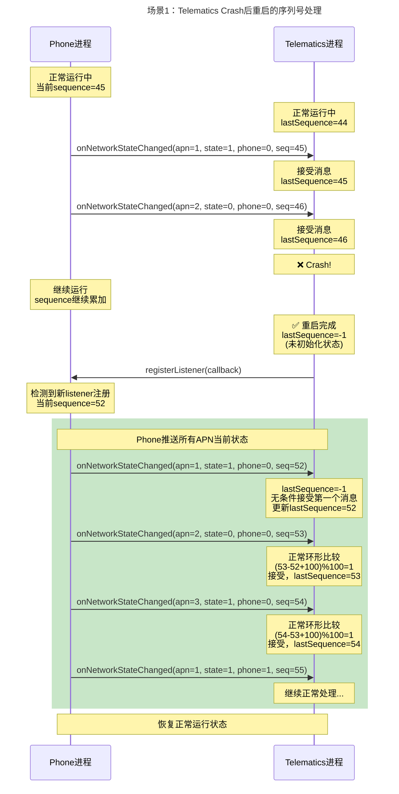
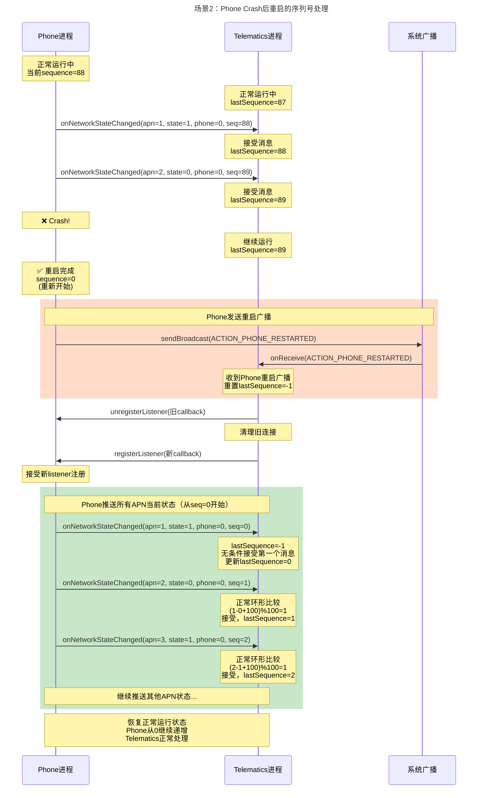

# Mermaid时序图使用说明

## 场景1：Telematics Crash后重启

## 场景2：Phone Crash后重启

## 使用方法

1. 将上面的mermaid代码复制到支持Mermaid的Markdown编辑器中
2. 或者使用在线工具如 [Mermaid Live Editor](https://mermaid.live/)
3. 也可以在支持Mermaid的文档工具中直接使用（如GitHub、GitLab等）

## 关键点说明

### 场景1关键点：
- Telematics crash后lastSequence重置为-1
- 第一个消息无条件接受，不进行环形比较
- Phone检测到新listener后主动推送全量状态

### 场景2关键点：
- Phone crash后发送重启广播
- Telematics收到广播后主动重置lastSequence为-1
- Phone sequence从0重新开始
- 通过广播机制保证双方状态同步