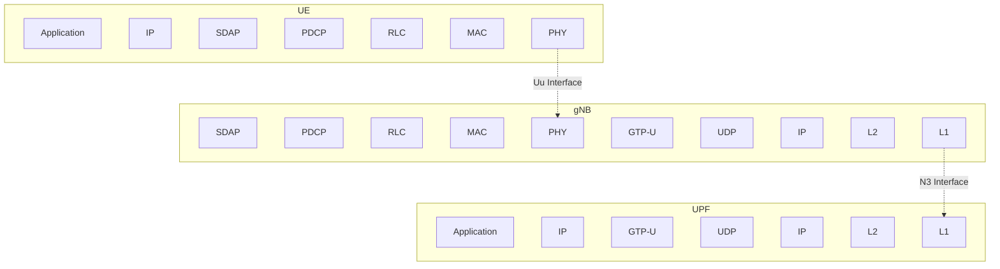

# NR Data Link Establishment Signaling Flow

## 5G NR Data Link Establishment Sequence Diagram

```mermaid
sequenceDiagram
    participant UE as UE (User Equipment)
    participant gNB as gNB (Base Station)
    participant AMF as AMF (Access and Mobility Management Function)
    participant SMF as SMF (Session Management Function)
    participant UPF as UPF (User Plane Function)

    Note over UE,gNB: Initial Access Procedure
    
    %% Random Access Procedure
    UE->>gNB: RACH Preamble (Msg1)
    gNB->>UE: Random Access Response (Msg2)
    Note right of gNB: TA, TC-RNTI, UL Grant
    
    UE->>gNB: RRC Setup Request (Msg3)
    Note right of UE: UE Identity, Establishment Cause
    
    gNB->>UE: Contention Resolution (Msg4)
    Note right of gNB: C-RNTI Assignment
    
    %% RRC Connection Establishment
    gNB->>UE: RRC Setup
    Note right of gNB: SRB1 Configuration
    
    UE->>gNB: RRC Setup Complete
    Note right of UE: NAS: Registration Request
    
    %% Initial UE Message to Core Network
    gNB->>AMF: Initial UE Message
    Note right of gNB: Registration Request, RAN-UE-NGAP-ID
    
    %% Authentication and Security
    AMF->>UE: Authentication Request
    UE->>AMF: Authentication Response
    
    AMF->>UE: Security Mode Command
    UE->>AMF: Security Mode Complete
    
    %% Registration Accept
    AMF->>UE: Registration Accept
    Note right of AMF: 5G-GUTI, TAI List
    
    %% PDU Session Establishment
    Note over UE,UPF: PDU Session Establishment
    
    UE->>AMF: PDU Session Establishment Request
    Note right of UE: PDU Session ID, DNN, S-NSSAI
    
    AMF->>SMF: Nsmf_PDUSession_CreateSMContext Request
    
    SMF->>UPF: N4 Session Establishment Request
    UPF->>SMF: N4 Session Establishment Response
    
    SMF->>AMF: Nsmf_PDUSession_CreateSMContext Response
    
    %% RRC Reconfiguration for DRB
    AMF->>gNB: PDU Session Resource Setup Request
    Note right of AMF: QoS Flows, UPF Info
    
    gNB->>UE: RRC Reconfiguration
    Note right of gNB: DRB Configuration, SDAP/PDCP Config
    
    UE->>gNB: RRC Reconfiguration Complete
    
    gNB->>AMF: PDU Session Resource Setup Response
    
    %% User Plane Path Establishment
    Note over gNB,UPF: User Plane Path Setup
    
    gNB<-->UPF: N3 Tunnel Establishment (GTP-U)
    
    %% Data Transfer Ready
    Note over UE,UPF: Data Link Established - Ready for Data Transfer
    
    UE<-->gNB: User Data (DRB)
    gNB<-->UPF: User Data (N3 Interface)
```

## Key Components Explained

### 1. **Random Access Procedure (Msg1-4)**
- **Msg1**: UE sends RACH preamble to initiate connection
- **Msg2**: gNB responds with timing advance, temporary identifier (TC-RNTI), and uplink grant
- **Msg3**: UE sends RRC Setup Request with its identity
- **Msg4**: gNB resolves contention and assigns permanent C-RNTI

### 2. **RRC Connection Establishment**
- Establishes Signaling Radio Bearer 1 (SRB1) for control signaling
- UE includes initial NAS message (Registration Request)

### 3. **Registration and Authentication**
- AMF performs authentication and security setup
- Establishes NAS security context
- Assigns 5G-GUTI for UE identification

### 4. **PDU Session Establishment**
- Creates user plane connection for data transfer
- SMF coordinates with UPF to set up data path
- QoS flows are configured based on service requirements

### 5. **Radio Bearer Configuration**
- Data Radio Bearer (DRB) is configured
- SDAP (Service Data Adaptation Protocol) maps QoS flows to DRBs
- PDCP (Packet Data Convergence Protocol) handles security and header compression

### 6. **User Plane Path**
- N3 tunnel established between gNB and UPF using GTP-U protocol
- End-to-end data path ready for user traffic

## Protocol Stack Overview



This sequence diagram illustrates the complete signaling flow for establishing a data link in 5G NR, from initial access through to user plane establishment.